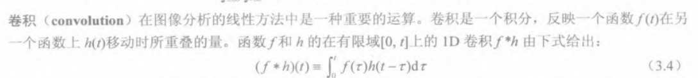
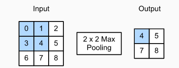

1. **数字图像**：
   - 又称 数码图像或 数位图像，是二维图像用有限数字数值像素的表示。由数组或矩阵表示，其光照位置和强度都是离散的。

2. **像素**：
   - 像素是数字图像中的最小信息单位，是构成图像的基本元素。每个像素包含颜色或灰度的信息，通常通过RGB（红绿蓝）颜色模型等表示。

3. **分辨率**：
   - 分辨率是描述图像清晰度和细节程度的度量，通常指图像中的像素总数，例如1920x1080。分辨率越高，图像包含的信息越多，显示的细节也越丰富。

4. **二值化**：
   - 二值化是图像处理中的一种技术，将图像中的像素值转换为两种颜色（通常为黑和白）。它通常用于简化图像数据，便于进一步分析和处理。

     [二值化](https://blog.csdn.net/m0_38106923/article/details/115206093)
   
5. **卷积**：
   - 在图像处理和深度学习中，卷积是一种数学运算，通过一个称为卷积核的小矩阵在图像上滑动，与图像的局部区域进行元素级乘法并求和，从而提取特征。卷积能有效检测图像中的边缘、纹理等信息。
   - 
   - 书上的解释
      

6. **Hough变换（霍夫变换）**：
   
   - 霍夫变换用于辨别找出对象中的特征，例如：线条。算法流程大致如下，给定一个对象、要辨别的形状的种类，算法会在[参数空间](https://zh.wikipedia.org/w/index.php?title=參數空間&action=edit&redlink=1)中执行投票来决定物体的形状，而这是由累加空间里的[局部最大值](https://zh.wikipedia.org/wiki/极值)来决定。
   
7. **平滑**：
   
   - 平滑（或模糊）是一种减少图像中噪声和细节的处理技术，通常通过将每个像素替换为其邻近像素的平均值来实现。常见的平滑方法有均值滤波、高斯滤波等，它们通过邻域像素的平均值来代替中心像素值，以此减少随机波动。
   
8. **锐化**：
   
   - 锐化是增强图像中细节的过程，通常通过增强图像的高频成分实现。这使得边缘和细节更加突出，提高图像的视觉效果。

9. **监督学习**：
   
   - 监督学习是机器学习的一种方式，其中模型从带有标签的训练数据学习，并利用这些学习到的模式对新的数据进行预测。
   
10. **非监督学习**：
    - 非监督学习是另一种机器学习形式，模型在没有标签的数据上进行训练，以发现数据的隐藏结构或模式。

    [监督和无监督学习的区别](https://www.bilibili.com/video/BV1ot411P77s/?spm_id_from=333.337.search-card.all.click&vd_source=b37382cda65d4d9bed5b1252dd598add)
    
11. **池化**：
    - 池化是卷积神经网络中常见的操作，用于减少数据的空间大小（降维），增强特征的鲁棒性。常见的池化操作包括最大池化和平均池化。
    - 下图为二维数据最大池化
    - 

12. **直方图**：
    
    - **图像直方图**是用来**表现图像中亮度分布的直方图**，给出的是图像中某个亮度或者某个范围亮度下共有几个像素，**即统计一幅图某个亮度像素数量**。
    - 
    
13. **RGB颜色系统模型**：
    
    - RGB模型是基于电子屏幕显示的色彩模式，R（Red）、G（Green）、B（Blue）分别代表红、绿、蓝三种基本色光。在这个模型中，不同的颜色通过改变这三种颜色的强度组合来产生。
    
14. **YUV颜色系统模型**：
    
    - YUV是一种颜色编码系统，主要用于视频压缩和广播。它将颜色图像分解为一个亮度分量（Y）和两个色度分量（U和V），有助于更好地适应人类视觉系统的特性，减少带宽的使用而不过分影响视觉质量。
