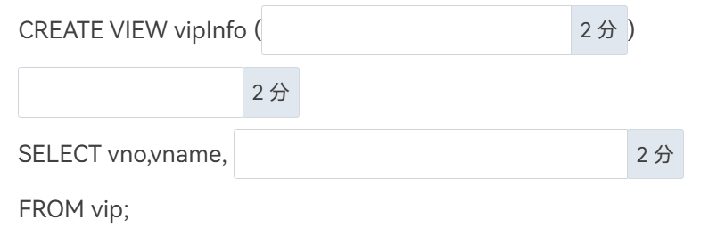
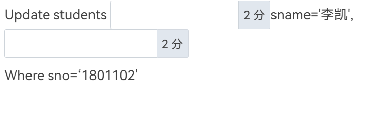
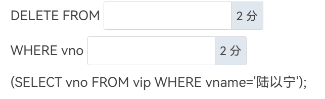
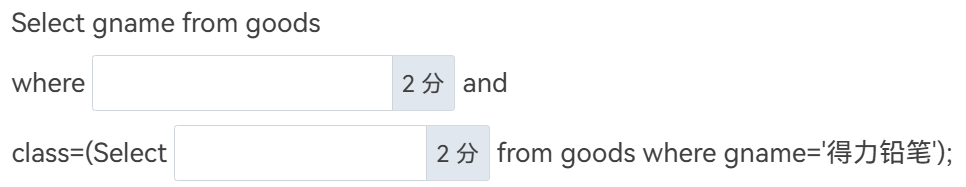
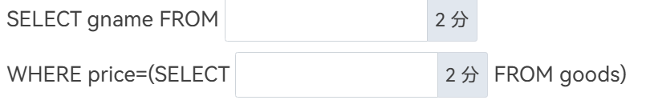

1. 数据库的三级模式结构中，描述局部数据的逻辑结构和特征的是( ____ )。 

2. 数据模型的组成要素中描述系统静态特性的是( ____ )，描述系统动态特性的是( ____ )。

3. 关系模型中，关系操作包括查询和( ____ )两类。

4. 数据管理技术的发展经历了人工管理阶段、( ____ )阶段和数据库系统阶段。

5. 关系数据库中用( ____ )  实现参照完整性。

6. 关系数据库中，体现”实体能够区分并唯一标识元组”的规则是( ____ )规则 ，( ____ )规则的实质是“不允许引用不存在的实体”。

7. ( ____ )是长期存储在计算机内有组织、可共享的大量数据的集合。

8. 定义了物理存储中数据是怎样和在哪里组织的模式是( ____ )。

9. 数据库系统由数据库、( ____ )、应用系统和( ____ )组成。

10. 假设存在一张职工表，包含“性别”属性，要求这个属性的值只能取“男”或“女”，这属于( ____ )的完整性 。

11. 数据库三级模式中，描述数据库全体数据逻辑结构和特征的是 ( ____ ) 

12. 假设关系R中有5个属性，10个元组；关系S中3个属性，100个元组，则RXS运算结果中有( ____ )个属性，有( ____ )条元组。

13. 产生数据冗余和异常的两个重要原因是部分函数依赖和                                    ( ____ ) 依赖

14. 某超市要设计一个管理系统，其中部分应用为：

    部门管理，包括部门编号，部门名称；

    员工信息管理，包括员工编号，员工姓名，性别，职务，所在部门；

    商品信息包括：商品编号，商品名称，类别，数量，单价；

    供应商信息包括：供应商编号，供应商名称，地址，电话，联系人。

    其中，员工的工作是将商品入库，并登记入库信息；这些商品要销售给各供应商，需要提供每个商品的商品编号，单价 ，数量，供应商编号和业务员编号等。

    请根据需求分析情况回答下面的问题。

    1、对该数据库进行概念结构设计（ER图）时应该有 ( ____ )  个实体。

    2、实体商品对应的属性个数是 ( ____ )

    3、部门和员工之间的管理联系是 ( ____ ) ；员工和商品之间的入库联系是

    ( ____ ) ；商品和供应商之间的销售联系是 ( ____ )。

15. 某企业集团有若干工厂，每个工厂生产多种产品，且每一种产品可以在多个工厂生产，每个工厂按照固定的计划数量生产产品；每个工厂聘用多名职工，且每名职工只能在一个工厂工作，工厂聘用职工有聘期和工资。工厂的属性有工厂编号、厂名、地址，产品的属性有产品编号、产品名、规格，职工的属性有职工号、姓名。

    请根据需求分析情况回答下面的问题。

    1、对该数据库进行概念结构设计（ER图）时应该有 ( ____ ) 个实体， ( ____ ) 个联系。

    2、工厂和职工之间的联系是 ( ____ )，其联系的2个属性分别是 ( ____ ) 、 ( ____ ) 。

16. 分析下面的语义：

    有若干班级,每个班级包括: 班级号,班级名,专业,人数 ；

    每个班级有若干运动员，运动员只能属于一个班， 运动员属性:运动员编号,姓名,性别,年龄 ；

    有若干比赛项目，包括:项目号,名称,比赛地点 ；

    每名运动员可参加多项比赛，每个项目可有多名运动员参加 ；

    比赛项目有比赛名次和成绩属性。

    请根据语义分析情况回答下面的问题。

    1、对该数据库进行概念结构设计（ER图）时应该有 ( ____ ) 个实体。

    2、实体项目对应的属性个数是 ( ____ ) 个。

    3、班级和运动员之间的联系是 ( ____ )；运动员和项目之间的参赛联系是

    ( ____ )，该联系属性个数为 ( ____ ) 个。

17. 某医院数据库的部分关系模式为：科室（科室号，科室名，负责人，电话）、病患（病历号、姓名、住址、联系电话）和职工（职工号、职工姓名、科室号、住址，联系电话）。假设每个科室有一名负责人和一部电话，每个科室有若干职工，一名职工只能属于一个科室；一个医生可以为多个病患看病；一个病患可以由多个医生诊治。则科室与职工的所属联系类型是 ( ____ )

18. 使用二维表存储数据的数据库是 ( ____ ) 型数据库。

19. ( ____ ) 完整性，它要求表中所有的记录都应该有一个唯一标识，即主键。

20. ( ____ ) 完整性维护从表中的外码与主表中的主码的相容关系。

21. 关系完整性包括( ____ ) 完整性、( ____ ) 完整性、用户自定义完整性。

22. 能唯一标识实体的属性或属性组称为( ____ )。

23. 1：1关系模式的转换，直接将一个实体的主键插入到另一实体中作为( ____ ) 产生联系

24. 1：n这种关系模式转换，一般是将1的 ( ____ ) 插入到n的表中作为外键，以此产生联系.

25. m：n关系模式转换，一般会因为联系产生新的属性，联系会转化成关系模型，要将两个实体的( ____ ) 都插入到新的关系模式中。

26. 设有一个教学数据库，包括以下三个关系模式：

    学生关系：S (Sno,Sname,Ssex,Sage,Sdept)

    课程关系：C (Cno,Cname,Cpno,Ccredit)

    学习关系：SC (Sno,Cno,Grade)

    查询学生95001的姓名和所在系。关系代数表达式使用的符号：σπ×∞÷∪∩－∧∨≠（复制粘贴使用）

    

27. 设教学数据库中有3个关系：

    学生关系： S(SNO,SNAME,AGE,SEX)

    学习关系： SC(SNO,CNO,GRADE)

    课程关系： C(CNO,CNAME,TEACHER)

    下面用关系代数表达式表达每个查询语句。关系代数表达式使用的符号：σπ×∞÷∪∩－∧∨≠（复制粘贴使用）

    1.检索学习课程号为C2的学生学号与成绩。

    

28. 设教学数据库中有3个关系：

    学生关系： S(SNO,SNAME,AGE,SEX)

    学习关系： SC(SNO,CNO,GRADE)

    课程关系： C(CNO,CNAME,TEACHER)

    下面用关系代数表达式表达每个查询语句。关系代数表达式使用的符号：σπ×∞÷∪∩－∧∨≠（复制粘贴使用）

    检索学习课程号为C2的学生学号与姓名。

    

29. 设教学数据库中有3个关系：

    学生关系： S(SNO,SNAME,AGE,SEX)

    学习关系： SC(SNO,CNO,GRADE)

    课程关系： C(CNO,CNAME,TEACHER)

    下面用关系代数表达式表达每个查询语句。关系代数表达式使用的符号：σπ×∞÷∪∩－∧∨≠（复制粘贴使用）

    检索至少选修课程号为C2或C4的学生学号。

    

30. 在查询操作结果中不出现重复元组，应在SELECT子句中使用 ( ____ ) 保留字。

31. 在字符匹配查询中，通配符" ( ____ ) "代表零个或多 个字符，在字符匹配查询中，通配符“     ”代表 ( ____ ) 个字符。

32. 关系模型的数据操纵即是建立在关系上的数据操纵，一般有 ( ____ ) 、添加、( ____ ) 和修改四种操作。

33. 如果要计算表中数据的平均值，可以使用的聚集函数是 ( ____ ) 函数。

34. 如果要计算表中数据的总和值，可以使用的聚集函数是 ( ____ )  函数。

35. 如果要计算表中数据的最大值，可以使用的聚集函数是  ( ____ ) 函数。

36. 如果要计算表中数据的最小值，可以使用的聚集函数是 ( ____ )  函数。

37. 如果要统计表中元组个数，可以使用( ____ ) 函数。

38. SQL语句可以通过ORDER BY来进行排序，在列名后添加关键字 ( ____ ) 表示降序排序，添加或不添加（默认）关键字 ( ____ ) 表示升序排序。

39. 显示在2000年以后出生的学生基本信息，SQL语句是SELECT * FROM STU WHERE YEAR(BIRTHDAY) ( ____ ) 。

40. 列出选修了"001"课程的学生，按成绩的降序排列, SQL语句是

    SELECT SNO,GRADE FROM SC WHERE CNO 

     ( ____ )  ORDER BY GRADE  ( ____ )  。

41. 显示学生信息表中的学生总人数及平均年龄（年龄字段SAGE），在结果集中列标准分别显示为“学生总人数”、“平均年龄”，SQL语句是 

    SELECT COUNT(SNO) AS  ( ____ )  , ( ____ ) AS 平均年龄 from stu。

42. ( ____ ) 子句可以对分组统计后的结果进行筛选。

43. 表达式year('2021-7-1')+2的结果是 ( ____ ) 。

44. 统计每个类型的商品的个数，对应的SQL语句是：

    统计每个类型的商品的个数，对应的SQL语句是：

    SELECT class 种类, COUNT( * ) 个数 FROM goods GROUP BY 

     ( ____ )  ;

45. 外键约束中，主表和从表可以是 ( ____ )张表，也可以是 ( ____ )张表。

46. 某工程项目的部分关系如下：职工（职工编号，姓名，性别，居住城市）项目（项目编号，项目名称，状态，城市，负责人编号）职工项目（职工编号，项目编号）其中：职工可以同时参加多个项目，一个项目需要多个职工参加。那么如何查询职工编号为'000015',参加的项目名称和城市。

    select 项目名称,城市 from 项目 where 

    ( ____ ) (select ( ____ ) where 职工编号='000015')

47. 利用create table 命令创建student表，表结构见下图。

    CREATE TABLE student (

    sno char(7)  ( ____ ) ,

    sname varchar(8) not null,

    ssex char(2) not null,

    score decimal(5,1) ,

    class varchar(10) not null ,

    sfzh char(18)  ( ____ ) ,

    tp varchar(50),

    zw BLOB

    )

48. 利用create table 命令创建sc，表结构如下图。

    CREATE TABLE sc (

    sno char(7) NOT NULL,

    cno char(7) NOT NULL,

    score decimal(4, 1) ,

    point decimal(2, 1) ,

    PRIMARY KEY ( ( ____ ) ),

    FOREIGN KEY (sno) REFERENCES students (sno) ,

    FOREIGN KEY (cno) REFERENCES  ( ____ ) ) ;

49. 使用create view语句创建价格(price字段)高于10元的商品视图Vgoods2，商品来源于goods表。并要保证对该视图的修改都要符合价格高于10元这个条件。

    CREATE VIEW Vgoods2

     ( ____ ) 

    SELECT * FROM goods

    WHERE  ( ____ ) 

     ( ____ ) ;

50. 使用create view语句创建顾客信息的视图vipInfo，数据来源于vip表，视图中显示中文字段分别为顾客编号、姓名和年龄，其中顾客出生日期字段名为birthday。

    

51. 使用update语句把学号为1801102的学生姓名（sname字段）改为“李凯”，出生日期（bday字段）改为“1999-10-11”。
-
    

52. 使用delete语句删除陆以宁的购物记录，其中购物表为sale，会员表为vip，会员表中vno是会员编号 ，vname是会员名

    

53. 使用select语句查询和“得力铅笔”同一类别的其他商品的名称，其中商品表为goods，gname字段表示商品名，class字段表示商品类别。

    

54. 使用select语句查询售价最高的商品的名称，其中商品表为goods，商品名称字段为gname，售价字段为price。

    

55. 数据库设计一般分为需求分析、( ____ )设计、( ____ )设计、( ____ )设计、数据库实施、数据库运行和维护6个阶段。

56. SQL 是结构化( ____ )语言（Structured Query Languaged）的缩写。

57. E-R数据模型一般在数据库设计的( ____ )设计阶段使用。

58. 数据库系统的三级模式结构是指数据库系统由外模式、模式和 ( ____ )三级构成。

59. 利用create table 命令创建borrow表，表结构见下图：

60. 数据库管理系统的简称是( ____ )。
