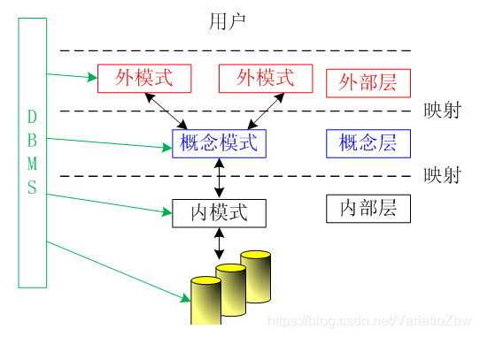

一、模式（Schema）
定义：模式又称概念模式或逻辑模式，是数据库中全体数据的逻辑结构和特征的描述，是所有用户的公共数据视图。

理解： ① 一个数据库只有一个模式； ② 是数据库数据在逻辑级上的视图； ③ 数据库模式以某一种数据模型为基础； ④ 定义模式时不仅要定义数据的逻辑结构（如数据记录由哪些数据项构成，数据项的名字、类型、取值范围等），而且要定义与数据有关的安全性、完整性要求，定义这些数据之间的联系。

二、外模式（External Schema）
定义：也称子模式（Subschema）或用户模式，是数据库用户（包括应用程序员和最终用户）能够看见和使用的局部数据的逻辑结构和特征的描述，是数据库用户的数据视图，是与某一应用有关的数据的逻辑表示。

理解： ① 一个数据库可以有多个外模式； ② 外模式就是用户视图； ③ 外模式是保证数据安全性的一个有力措施。

三、内模式（Internal Schema）
定义：也称存储模式（Storage Schema），它是数据物理结构和存储方式的描述，是数据在数据库内部的表示方式（例如，记录的存储方式是顺序存储、按照B树结构存储还是按hash方法存储；索引按照什么方式组织；数据是否压缩存储，是否加密；数据的存储记录结构有何规定）。

理解： ① 一个数据库只有一个内模式； ② 一个表可能由多个文件组成，如：数据文件、索引文件。 它是数据库管理系统(DBMS)对数据库中数据进行有效组织和管理的方法 其目的有： ① 为了减少数据冗余，实现数据共享； ② 为了提高存取效率，改善性能。
