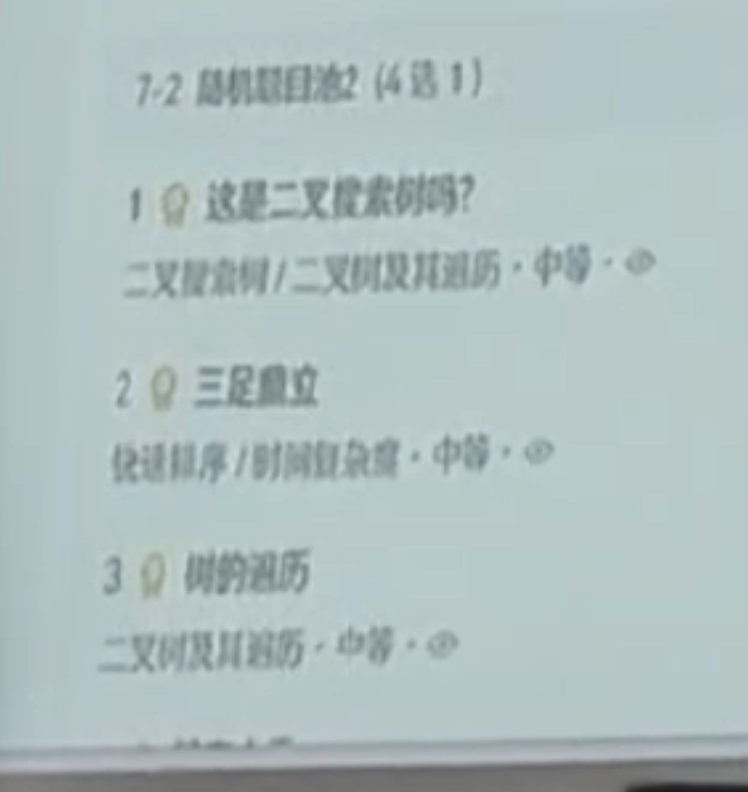

# 函数题 (2选1)
- 6-1 (2选1)
- 1.凸多边形三角划分的计数 (组合计数)
- 2.可重复选择的组合数问题 (组合计数)

- 6-2 (2选1)
- 1.最大连续和 (动态规划)
- 2.最长上升子序列 (动态规划)

# 程序填空题 (12抽7)
## 5.1 (2选1)
- 1 有重复元素全相邻的计数问题 (组合计数)
- 2 棋盘格里数石子 (组合论问题)
  
## 5.2 (4选3)
- 1 找零钱 (动态规划)
- 2 树状数组 (树状数组)
- 3 亲戚关系 (并查集)
- 4 区间最小值问题 (动态规划)

## 5.3 (3选1)
- 1 两系线段的相交问题 (向量运算)
- 2 某点在凹或凸多边形的内部还是外部的判定 (几何问题)
- 3 某点在凸多边形的内部还是外部的判定 (几何问题)

## 5.4 (2选1)
- 1 求解一条直线和若干个圆的交点 (附加题,选做) (向量运算)
- 2 线段树 (附加题,选做) (线段树)

## 5.5 (1选1)
- 1 基于x水平有序的凸包构造算法(Andrew凸包算法) (附加题,选做)

# 编程题 (7选2)
## 7.1 (3选1)
- 连续因子 >
- N个数求和
- 均是素数

## 7.2(4选1)
- 这是二叉搜索树吗?
- 三足鼎立
- 树的遍历
- 链表去重(不一定)
  